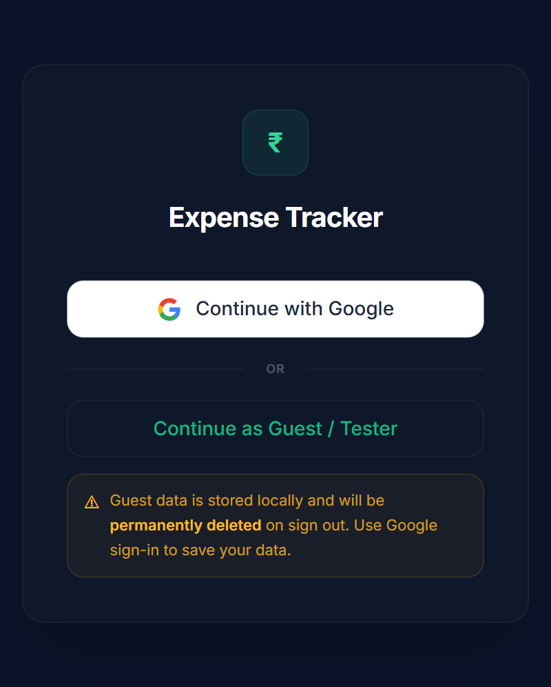
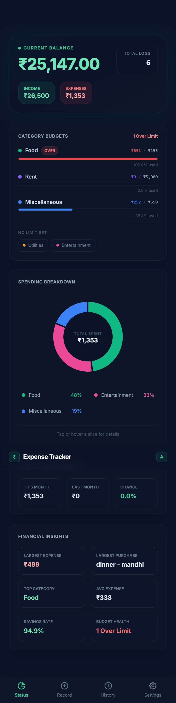
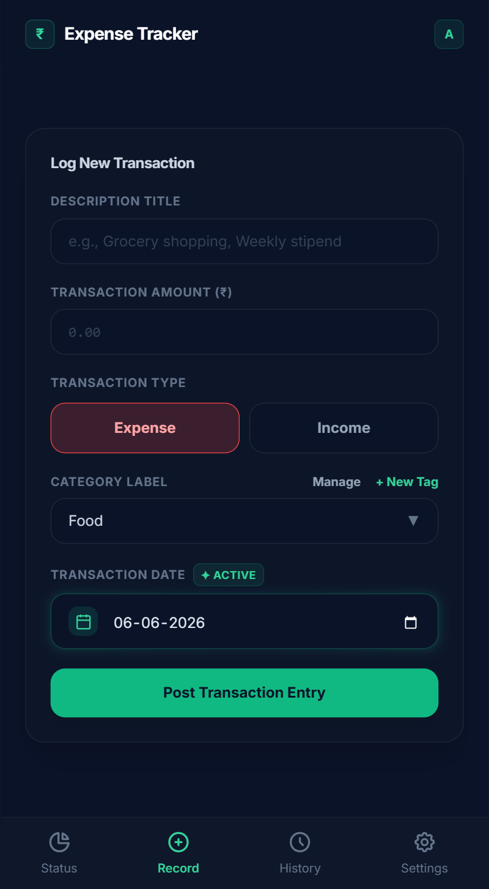
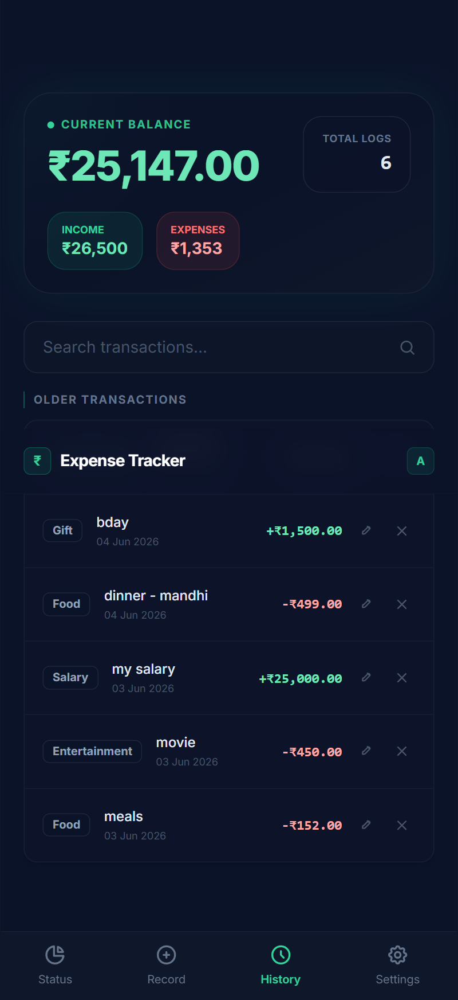
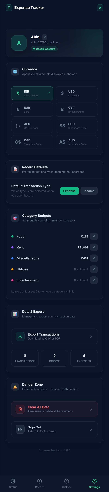
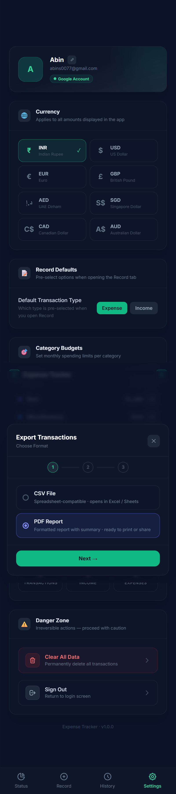
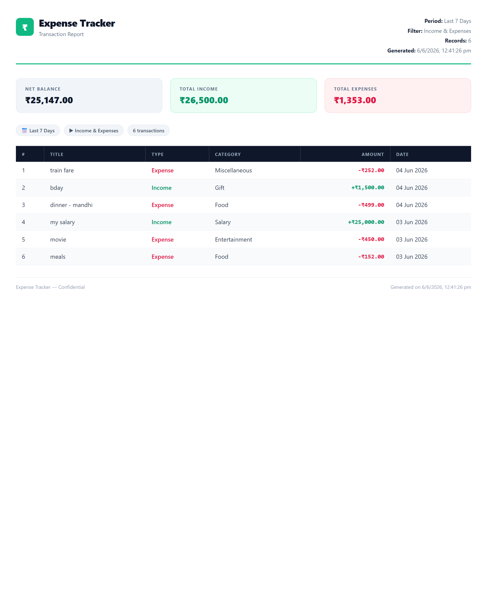

<div align="center">



# Expense Tracker

A mobile-first personal finance app built with **React** and **Firebase** — track income and expenses, set category budgets, and export reports as CSV or PDF.


</div>

---

## Screenshots

<div align="center">

<table>
  <tr>
    <td align="center"><b>Status Dashboard</b></td>
    <td align="center"><b>Log Transaction</b></td>
    <td align="center"><b>Transaction History</b></td>
  </tr>
  <tr>
    <td></td>
    <td></td>
    <td></td>
  </tr>
  <tr>
    <td align="center"><b>Settings</b></td>
    <td align="center"><b>Export — Date Range</b></td>
    <td align="center"><b>PDF Report Output</b></td>
  </tr>
  <tr>
    <td></td>
    <td></td>
    <td></td>
  </tr>
</table>

</div>

---

## Features

- **Google Sign-In** via Firebase Authentication — one tap to log in
- **Guest / Tester Mode** — try the app without an account; data stored locally
- **Log Transactions** — add income or expenses with title, amount, category, and date
- **Edit & Delete** transactions with confirmation prompt
- **Category Budgets** — set monthly spending limits per category with live progress bars and over-limit alerts
- **Status Dashboard** — interactive donut chart, monthly comparison, financial insights (savings rate, top category, avg expense, budget health)
- **Transaction History** — searchable list with income/expense colour coding and edit controls
- **Multi-currency Support** — INR, USD, EUR, GBP, AED, SGD, CAD, AUD
- **Export Transactions** — 3-step modal to export filtered data as CSV (Excel/Sheets compatible) or a formatted PDF report
- **Per-user data isolation** — each signed-in user sees only their own data via Firebase Realtime Database
- **Mobile-first layout** — stays centred and usable on both phone and desktop

---

## Tech Stack

| Layer    | Technology                                            |
| -------- | ----------------------------------------------------- |
| Frontend | React 19, Vite 8                                      |
| Styling  | Tailwind CSS (CDN)                                    |
| Auth     | Firebase Authentication (Google)                      |
| Database | Firebase Realtime Database                            |
| Export   | Client-side CSV generation, HTML-to-PDF via print API |

---

## Getting Started

### 1. Clone the repository

```bash
git clone https://github.com/your-username/expense-tracker.git
cd expense-tracker
```

### 2. Install dependencies

```bash
npm install
```

### 3. Set up Firebase

1. Go to [Firebase Console](https://console.firebase.google.com/) and create a project
2. Enable **Google Sign-In** under Authentication → Sign-in method
3. Enable **Realtime Database** and set up security rules (see below)
4. Register a web app and copy your Firebase config

### 4. Configure environment variables

Copy the example env file and fill in your Firebase config values:

```bash
cp .env.example .env
```

```env
VITE_FIREBASE_API_KEY=your_api_key
VITE_FIREBASE_AUTH_DOMAIN=your_project_id.firebaseapp.com
VITE_FIREBASE_PROJECT_ID=your_project_id
VITE_FIREBASE_STORAGE_BUCKET=your_project_id.firebasestorage.app
VITE_FIREBASE_MESSAGING_SENDER_ID=your_sender_id
VITE_FIREBASE_APP_ID=your_app_id
VITE_FIREBASE_DATABASE_URL=https://your_project_id-default-rtdb.firebaseio.com
```

### 5. Start the development server

```bash
npm run dev
```

Open [http://localhost:5173](http://localhost:5173) in your browser.

---

## Firebase Database Rules

Apply these rules in Firebase Console → Realtime Database → Rules to ensure each user can only access their own data:

```json
{
  "rules": {
    "expenses": {
      "$uid": {
        ".read": "$uid === auth.uid",
        ".write": "$uid === auth.uid"
      }
    },
    "users": {
      "$uid": {
        ".read": "$uid === auth.uid",
        ".write": "$uid === auth.uid"
      }
    }
  }
}
```

---

## Project Structure

```
expense-tracker/
├── public/
│   └── favicon.svg
├── src/
│   ├── components/
│   │   ├── BalanceCounter.jsx    # Animated balance display
│   │   ├── ExportModal.jsx       # 3-step CSV / PDF export flow
│   │   ├── HistoryTimeline.jsx   # Searchable transaction list
│   │   ├── PremiumModal.jsx      # Premium feature modal
│   │   ├── SettingsTab.jsx       # Currency, budgets, data & export
│   │   ├── StatusTab.jsx         # Dashboard, pie chart, insights
│   │   └── TransactionForm.jsx   # Log / edit transaction form
│   ├── utils/
│   │   └── categories.js         # Category definitions and helpers
│   ├── firebase.js               # Firebase initialisation
│   ├── App.jsx                   # Root component, auth & data logic
│   └── main.jsx
├── .env.example
├── .gitignore
└── README.md
```

## Build for Production

```bash
npm run build
```

Preview the production build locally:

```bash
npm run preview
```

The `dist/` folder is ready to deploy to **Vercel**, **Netlify**, or **GitHub Pages**. Remember to add your deployed domain to Firebase Authentication → Authorized domains.

---

## Roadmap

- [ ] Recurring transaction support
- [ ] Weekly / monthly budget overview chart
- [ ] Push notifications for budget alerts
- [ ] Dark / light theme toggle
- [ ] Mobile app via Capacitor (Android / iOS)

---

## License

This project is open source and available under the [MIT License](LICENSE).
